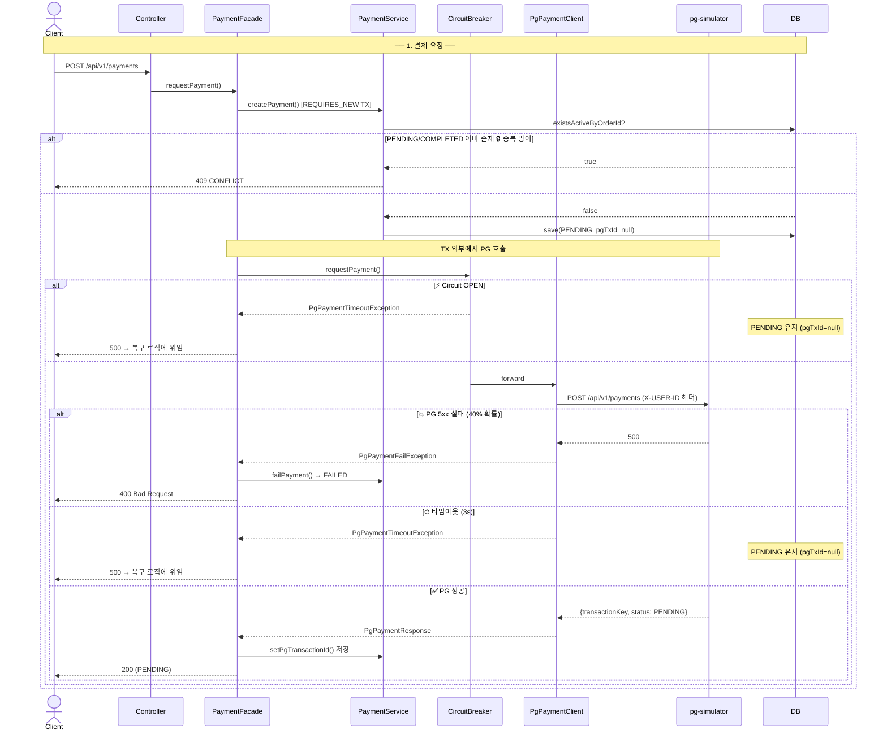
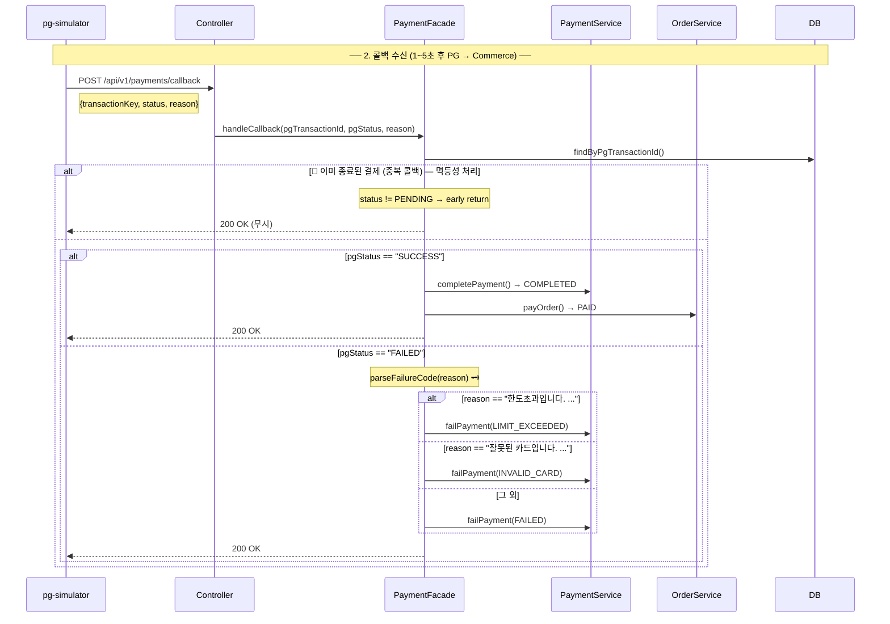
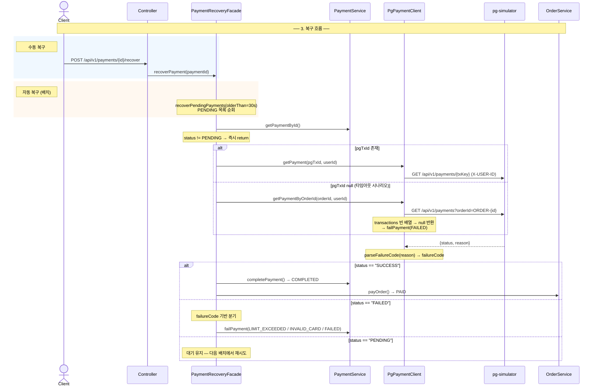
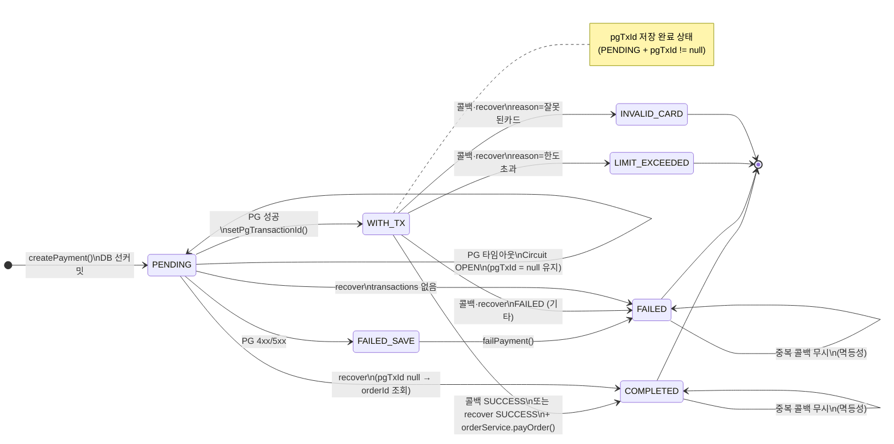

# 결제 프로세스 흐름 및 장애 대응

## 목차
1. [결제 요청 흐름](#1-결제-요청-흐름)
2. [콜백 처리 흐름](#2-콜백-처리-흐름)
3. [복구 흐름](#3-복구-흐름)
4. [Payment 상태 전이도](#4-payment-상태-전이도)
5. [장애 대응 요약](#5-장애-대응-요약)

---

## 1. 결제 요청 흐름



### 핵심 설계 포인트

| 구간 | 설계 의도 |
|------|---------|
| `REQUIRES_NEW` 트랜잭션으로 Payment 선커밋 | PG 호출 시간 동안 DB 커넥션을 붙잡지 않음 |
| PG 호출을 트랜잭션 외부에서 실행 | PG 실패가 내부 DB 롤백을 유발하지 않음 |
| `existsActiveByOrderId` 중복 체크 | 동일 주문에 PENDING/COMPLETED 결제가 이미 있으면 CONFLICT |
| FAILED 상태는 "활성"으로 간주하지 않음 | PG 실패 후 재결제 허용 |

---

## 2. 콜백 처리 흐름



### 핵심 설계 포인트

| 구간 | 설계 의도 |
|------|---------|
| `status != PENDING` early return | PG 콜백 재전송 시 중복 처리 방지, 항상 200 반환 |
| `parseFailureCode(reason)` | PG reason 문자열 파싱을 한 곳에 응집, `contains` 대신 정확한 `==` 매칭 |
| `PgFailureCode` enum | 애플리케이션 레이어가 PG 원문 문자열을 알지 못하도록 경계에서 타입 변환 |

---

## 3. 복구 흐름



### 핵심 설계 포인트

| 구간 | 설계 의도 |
|------|---------|
| pgTxId 유무로 조회 방식 분기 | 타임아웃으로 pgTxId 저장 전 실패한 경우도 orderId 기반으로 복구 가능 |
| `status != PENDING` early return | 이미 종료된 결제에 recover 중복 호출 시 안전 |
| 수동 + 자동 두 진입점 | 수동(`POST /{id}/recover`)은 즉시 복구, 자동(`recoverPendingPayments`)은 30초 초과 PENDING 일괄 처리 |
| Circuit OPEN 시 `log.warn` 흡수 | 복구 실패가 다른 결제 복구를 막지 않음 |

---

## 4. Payment 상태 전이도



---

## 5. 장애 대응 요약

| # | 장애 시나리오 | 내부 상태 | 대응 방법 |
|---|-------------|---------|---------|
| 1 | PG 5xx 실패 (40% 확률) | PENDING → FAILED | `PgPaymentFailException` catch → `failPayment()` |
| 2 | PG 응답 타임아웃 (3s) | PENDING 유지 (pgTxId=null) | 복구 로직에 위임, 클라이언트 500 반환 |
| 3 | Circuit Breaker OPEN | PENDING 유지 (pgTxId=null) | fallback → `PgPaymentTimeoutException`, 복구 위임 |
| 4 | `setPgTransactionId` 저장 전 장애 | PENDING (pgTxId=null) | recover 시 `getPaymentByOrderId`로 복구 |
| 5 | PG 콜백 중복 수신 | 이미 COMPLETED/FAILED | `status != PENDING` early return → 200 반환 (멱등) |
| 6 | 동일 주문 결제 중복 요청 | 첫 번째 PENDING 유지 | `existsActiveByOrderId` → 409 CONFLICT |
| 7 | PG reason 문자열 변경 | — | `parseFailureCode` 단일 함수에서만 파싱, 수정 지점 1개 |
| 8 | 복구 중 PG 재장애 | PENDING 유지 | `recoverPendingPayments`에서 예외 흡수 → 다음 배치 재시도 |

### Circuit Breaker 설정

```yaml
resilience4j:
  circuitbreaker:
    instances:
      pg-payment:
        slidingWindowSize: 10          # 최근 10회 호출 기준
        failureRateThreshold: 50       # 50% 이상 실패 시 OPEN
        waitDurationInOpenState: 30s   # 30초 후 HALF_OPEN 전환
        permittedNumberOfCallsInHalfOpenState: 3
  timelimiter:
    instances:
      pg-payment:
        timeoutDuration: 3s            # 3초 초과 시 타임아웃
```
