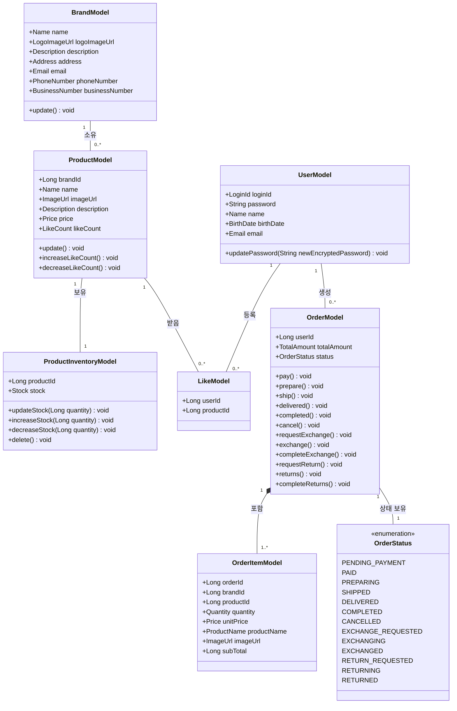

# 클래스 다이어그램

## 1. 전체 도메인 개요

### 도메인 모델 설명

#### 핵심 도메인

| 도메인 | 책임 | 핵심 행위 |
|--------|------|-----------|
| **User** | 사용자 정보 관리 | 회원가입 |
| **Brand** | 브랜드 정보 관리 | 브랜드 등록, 정보 수정, 사업자 정보 관리 |
| **Product** | 상품 정보 관리 | 상품 등록, 상품 정보, 좋아요 수 관리 |
| **ProductInventory** | 상품 재고 관리 | 재고 증감, 재고 가용성 확인 |
| **Like** | 사용자의 상품 좋아요 관리 | 좋아요 등록 및 취소, 중복 좋아요 방지 |
| **Order** | 주문 정보 관리 | 주문 생성, 주문 총액 계산, 주문 상태 변경 |
| **OrderItem** | 주문 상세 정보 관리 | 주문 시점의 상품 정보 스냅샷 보관 |
| **OrderStatus** | 주문 상태 표현 | 주문 진행 상태 |

#### 주요 불변식

- **User, Brand, Product의 소프트 삭제**: `deletedAt이 null이 아닌 경우`에도 데이터는 물리적으로 보존되며, 조회 시 필터링하여 비즈니스 로직에서 제외
- **Product의 likeCount**: Like 엔티티 생성/삭제 시 Product의 likeCount를 원자적으로 증감하여 정합성 유지
- **ProductInventory의 재고 정합성**: 동시성 제어를 통해 재고 감소 시 음수 방지 및 트랜잭션 격리 보장
- **Order와 OrderItem의 Aggregate 일관성**: Order는 Aggregate Root로서 OrderItem의 생명주기를 관리하며, 주문 총액은 항상 OrderItem의 합계와 일치
- **OrderItem의 스냅샷 불변성**: 주문 시점의 상품 가격과 정보를 스냅샷으로 보관하여, 이후 Product 변경에 영향받지 않음
- **재고 차감과 주문 생성의 트랜잭션 경계**: 주문 생성 시 ProductInventory 재고 차감이 동일 트랜잭션 내에서 원자적으로 처리됨

### 클래스 다이어그램

